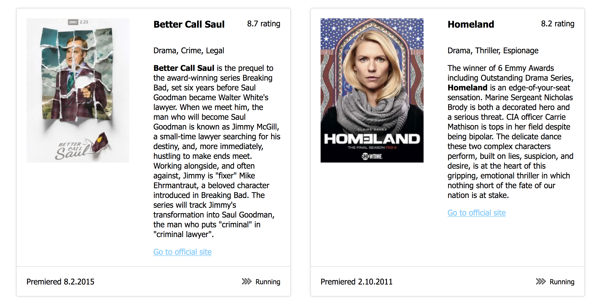

# Handlebars: display list data

In the `data.js` file you will find a list of tv series. Include it in your HTML and then display it using Handlebars.

Take a look at the example image to get an idea how it should look like:

You should display:
* the name
* the image (pick the size that fits best)
* the summary
* a link to the official site that should open in a new tab
* the rating
* the date it premiered
* the list of genres
* if the show is still running, display its status with the next icon. If the show has ended, display its status with the barrier icon.

## Extra:

* create a Handlebars helper to display the genres as comma separated list
* create a Handlebars helper to format the date

* create a helper to improve the built in if statement from handlebars. Currently you can write `{{#if isActive}}` to check if a property exists, but you cannot use comparison like `{{#if state === 'active'}}`. Let's write a helper that allows us to do this. The documentation is not very complete on this topic, but you can use `opts.fn(this)` to return the content nested in the if statement, and `opts.inverse(this)` to return the content nested in the else statement. `opts` is the last argument in the function passed to `registerHelper`.

## Docs:

Register helpers with Handlebars: https://handlebarsjs.com/api-reference/runtime.html#handlebars-registerhelper-name-helper